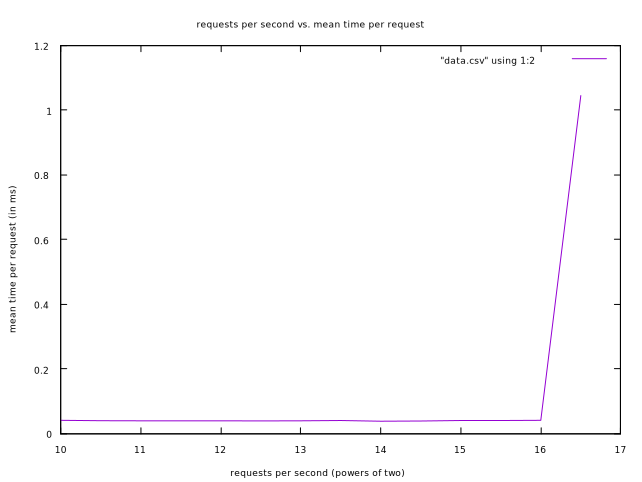

# Computer Systems Homework 5 (by Alyssa Riceman and Monica Moniot)

## 1: State Goals and Define System

We decided to keep our goals very simple: just measuring the average response time of our cache under various circumstances.

We defined our system as being comprised of our client and server programs, the hardware on which they run, and the network through which they communicate.

## 2: List Services and Outcomes

We listed off three services performed by the cache server, each with an array of possible outcomes.

* Service 1: send HTML responses to HTML requests
    * Outcome 1: the response is correct
    * Outcome 2: the response is incorrect
    * Outcome 3: no respone is sent
* Service 2: save user-input data for retrieval
    * Outcome 1: data is successfully saved in a retrievable fashion
    * Outcome 2: data is saved irretrievably or not saved at all
* Service 3: destroy itself when, and only when, given the command to do so
    * Outcome 1: on request, server successfully destroys itself
    * Outcome 2: on request, server fails to destroy itself
    * Outcome 3: server destroys itself despite a lack of request to do so

## 3: Select Metrics

We chose to focus exclusively on sustained throughput, defined as the highest messages-per-second rate at which average response time remains below 1 second.

## 4: List Parameters

Here are the parameters of interest that we came up with:

* Number of requests per second
* Average key size
* Variance in key size
* Average value size
* Variance in value size
* Network speed
* Network overhead
* Processor speed
* Processor overhead
* Ratios of different input types (read:write, write:delete, read:delete, et cetera)
* Maximum cache size

## 5: Select Factors to Study

We settled on three parameters to treat as factors of interest and use as the independent variables in our experiment, each with specific gradations of magnitude as recommended by the text.

* Factor 1: number of requests per second
    * Level 1: 2^10
    * Higher levels: 2^10.5, 2^11, 2^11.5, et cetera, increasing until we get a mean time over 1ms
* Factor 3: network speed
    * Level 1: network is localhost
    * Level 2: network is some non-localhost network

## 6: Select Evaluation Technique

Measurement seems like clearly the best option for us, since we have the client and server programs conveniently available and we don't need to worry about inconveniencing our day-to-day users with traffic from our tests since we don't have any day-to-day users.

## 7: Select Workload

To ensure similarity to the ETC workload described in [this paper](https://www.researchgate.net/publication/254461663_Workload_analysis_of_a_large-scale_key-value_store), we chose to comprise our workload of 65% GET requests, 5% SET requests, and 30% DELETE requests. We chose to order these requests randomly relative to each other, on the basis that we lack any specific expected use-case to simulate and randommess seemed like a solid default in absence of reasons to choose otherwise.

## 8: Design Experiment

We made a program to generate requests in accord with our workload chosen above, and then send the requests to the server via the client. Keys and values were each randomly-generated cstrings with mean size 25 and std. deviation 4. We had a 60% hit rate on GET requests, and 2% on DELETE requests, to ensure that the DELETEs didn't get everything that was set before we could try to GET it. We sent 5000 requests total for each requests-per-second rate, with a second of sleep between each bundle of requests to give the server a moment to cool down before the next bunch.

Initially, we attempted to run the program serially; however, this didn't work well, because the client waits for a server response before sending its next request, and thus the server was never fed more than one request at a time, which it could easily handle even given being sent many requests per second. To solve this problem, we multithreaded our benchmark, splitting each request into its own thread so that we could have many requests being sent to the server at one time.

We attempted to do the tests over a non-localhost network as well, as planned; however, varying network latency added so much noise (the average ping from moment to moment varied by somewhere on the order of half a millisecond) that, even given a pre-test check of average latency we couldn't get any sort of consistent results over the network.

## 9: Analyze and Interpret Data

The raw output of our program, on a relatively typical instance of a run which successfully terminated, is the following:

```
Starting 1024
Average time: 0.040290ms
Starting 1448
Average time: 0.039213ms
Starting 2048
Average time: 0.038773ms
Request time was longer than desired 1 times.
Starting 2896
Average time: 0.038759ms
Starting 4096
Average time: 0.038737ms
Starting 5792
Average time: 0.038333ms
Starting 8192
Average time: 0.038700ms
Request time was longer than desired 1 times.
Starting 11585
Average time: 0.039770ms
Starting 16384
Average time: 0.037611ms
Request time was longer than desired 1 times.
Starting 23170
Average time: 0.038201ms
Request time was longer than desired 37 times.
Starting 32768
Average time: 0.039817ms
Request time was longer than desired 181 times.
Starting 46340
Average time: 0.039618ms
Request time was longer than desired 544 times.
Starting 65536
Average time: 0.040277ms
Request time was longer than desired 2679 times.
Starting 92681
Average time: 1.044400ms
Request time was longer than desired 3396 times.
The highest number of requests per second with under 1ms mean response time was 65536.
```

Most runs of the program, however, did *not* terminate, instead resembling the following:

```
Starting 1024
Average time: 0.040500ms
Starting 1448
Average time: 0.039462ms
Starting 2048
Average time: 0.039207ms
Starting 2896
Average time: 0.039213ms
Starting 4096
Average time: 0.039105ms
Starting 5792
Average time: 0.038882ms
Request time was longer than desired 1 times.
Starting 8192
Average time: 0.039040ms
Starting 11585
Average time: 0.041019ms
Request time was longer than desired 6 times.
Starting 16384
Average time: 0.039104ms
Request time was longer than desired 1 times.
Starting 23170
Average time: 0.040966ms
Request time was longer than desired 37 times.
Starting 32768
Average time: 0.054593ms
Request time was longer than desired 738 times.
Starting 46340
Average time: 0.067278ms
Request time was longer than desired 479 times.
Starting 65536
Average time: 0.040967ms
Request time was longer than desired 2666 times.
Starting 92681
benchmark: client.cc:178: const void* cache_get(cache_type, key_type, index_type*): Assertion `serverReadLength >= 0 && "Failed to read from server."' failed.
Aborted (core dumped)
```

So, most of the time, the server couldn't handle the stream of requests at (nominally) 92681 requests per second, and instead would just time out a request and terminate. (It *is* a timeout, not any faster error; getting this result involves sitting and waiting for a minute or two after the "starting 92681" message.) During the occasional circumstance in which it manages to handle the stream, it still takes sufficiently longer to do so that it trips our over-1ms-average meter and terminates. Either way, the largest per-second load it can *actually* handle is 65536 requests per second.

We believe the cutoff point to be related to the limits of the processor on which we're running the benchmark. The "Request time was longer than desired [NUMBER] times" messages indicate how often the benchmark chooses not to sleep between requests and instead to immediately follow one request with another, which it does only when approaching the limits of how many messages per second it can send. It seems non-coincidental that the consistent cutoff point for our program is the same as the point at which, extrapolating trends, 5000 of our 5000 requests would be not-slept-after.

We specifically hypothesize this cutoff to be a product of running our client and server on the same machine; with the machine being rapidly flooded with 5000 request threads, we believe that the operating system doesn't know to prioritize the server over the pileup of threads, and thus it bounces between the threads until it times out, never giving the server a chance to answer all of its requests. This provides a strong reason to believe the results to be non-representative of what results would be were we to run the server on a machine separate from that running the benchmarking program. However, due to noisy connection speed, we were unable to do so with any effectiveness; thus the localhost data is the only worthwhile data we have.

## 10: Present Results

Here's a plot of our data, which does a pretty good job of making the salient point clear:



Mean response time remains near-constant right up until it undergoes a massive upward spike. That spike correponds to the time at which the program typically crashes due to server timeout. As discussed in Part 9, we hypothesize this structure to be a product of running the server and the benchmark on the same machine.